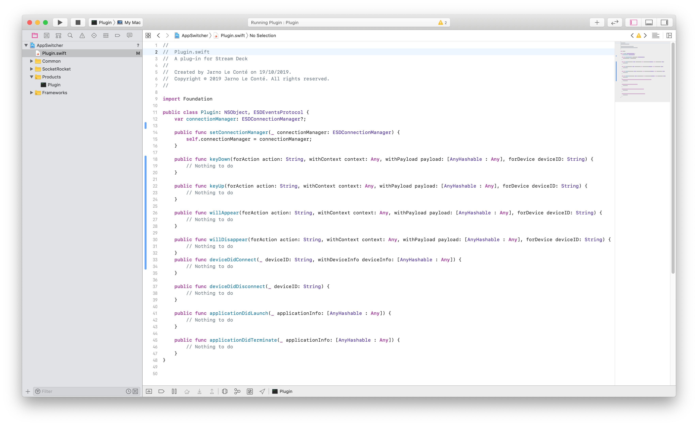

# Stream Deck Plugin Template: Swift

Use this template for creating a new [Stream Deck](https://www.elgato.com/gaming/stream-deck) plugin written in Swift (macOS only).
Implementation is based on the example plugin `AppleMail` provided by [Elgato](https://github.com/elgatosf/streamdeck-applemail) written in Objective-C.


# Description

If you want to create your own Stream Deck plugin for Mac, you can use this template if you prefer to write it in [Swift](https://docs.swift.org/swift-book/LanguageGuide/TheBasics.html).


# Features

- boilerplate to setup plugin and handle events
- code written in Swift
- make use of Objective-C libraries
- macOS only




# Getting started

1. The Sources folder contains the source code of the plugin.
2. Open the `StreamDeckPlugin.xcodeproj` in Xcode.
3. Start writing code in `Plugin.swift` where you can handle events like `keyDown`, `keyUp`, `willAppear`, etc...
4. Send commands to Stream Deck using the `connectionManager` instance available in `Plugin.swift`.
5. Finnaly you plugin should be bundled in the folder `com.COMPANYNAME.PLUGINNAME.sdPlugin` (replace `COMPANYNAME` and `PLUGINNAME`), and add a `manifest.json` file and other resources such as images.

# Events

This are all events that you can handle in `Plugin.swift`:

```Swift
public func keyDown(forAction action: String, withContext context: Any, withPayload payload: [AnyHashable : Any], forDevice deviceID: String) {
    // Nothing to do
}

public func keyUp(forAction action: String, withContext context: Any, withPayload payload: [AnyHashable : Any], forDevice deviceID: String) {
    // Nothing to do
}

public func willAppear(forAction action: String, withContext context: Any, withPayload payload: [AnyHashable : Any], forDevice deviceID: String) {
    // Nothing to do
}

public func willDisappear(forAction action: String, withContext context: Any, withPayload payload: [AnyHashable : Any], forDevice deviceID: String) {
    // Nothing to do
}
public func deviceDidConnect(_ deviceID: String, withDeviceInfo deviceInfo: [AnyHashable : Any]) {
    // Nothing to do
}

public func deviceDidDisconnect(_ deviceID: String) {
    // Nothing to do
}

public func applicationDidLaunch(_ applicationInfo: [AnyHashable : Any]) {
    // Nothing to do
}

public func applicationDidTerminate(_ applicationInfo: [AnyHashable : Any]) {
    // Nothing to do
}
```

If you need to handle other events you have to define them yourself in `Common/ESDEventsProtocol.h` and dispatch them in `Common/ESDConnectionManager.m`.

# Send commands to Stream Deck

If you want to send something to the Stream Deck, you can use the methods defined on the `connectionManager`. The `connectionManager` implements the following methods. You can call them from inside the event handlers.

```swift
connectionManager?.setTitle("New title", withContext: context, withTarget: ESDSDKTarget.HardwareAndSoftware.rawValue)

connectionManager?.setImage(someBase64ImageString, withContext: context, withTarget: ESDSDKTarget.HardwareOnly.rawValue)

connectionManager?.showAlert(forContext: context)

connectionManager?.showOK(forContext: context)

connectionManager?.setSettings(["key1": "value1", "key2": "value2"], forContext: context)

connectionManager?.setState(1, forContext: context)

connectionManager?.logMessage("Some log message")

```

If you want to call some other stream deck method, you have to define it yourself in `Common/ESDConnectionManager.m` and implement it in `Common/ESDConnectionManager.m`.

# More information

More information about writing Stream Deck plugins in general can be found on the [Developer section](https://developer.elgato.com/documentation/stream-deck/sdk/overview/) at the web site of [Elgato](https://developer.elgato.com/documentation/stream-deck/sdk/overview/).
